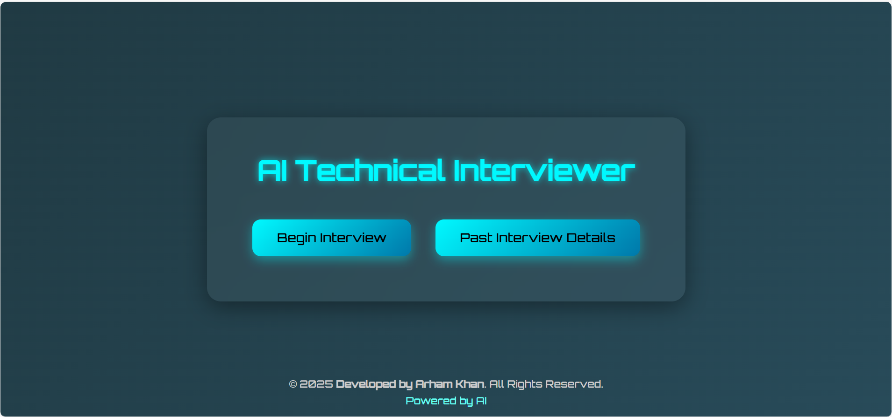
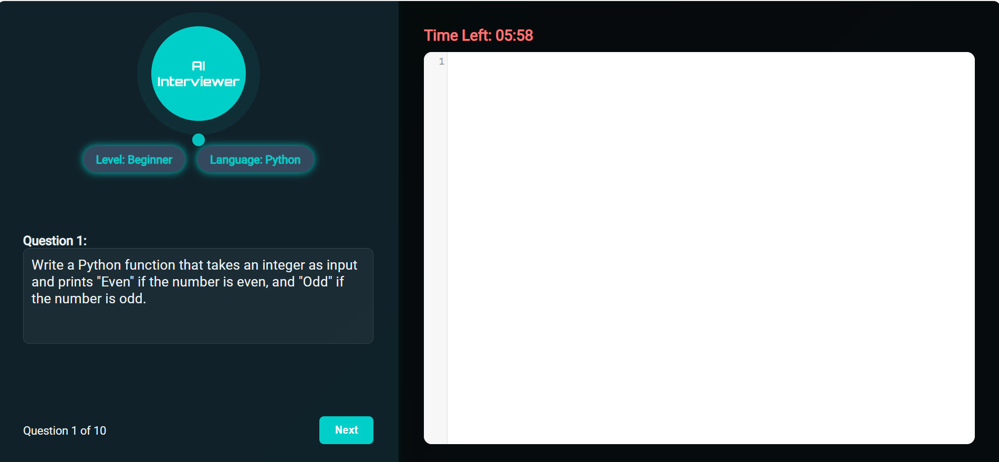
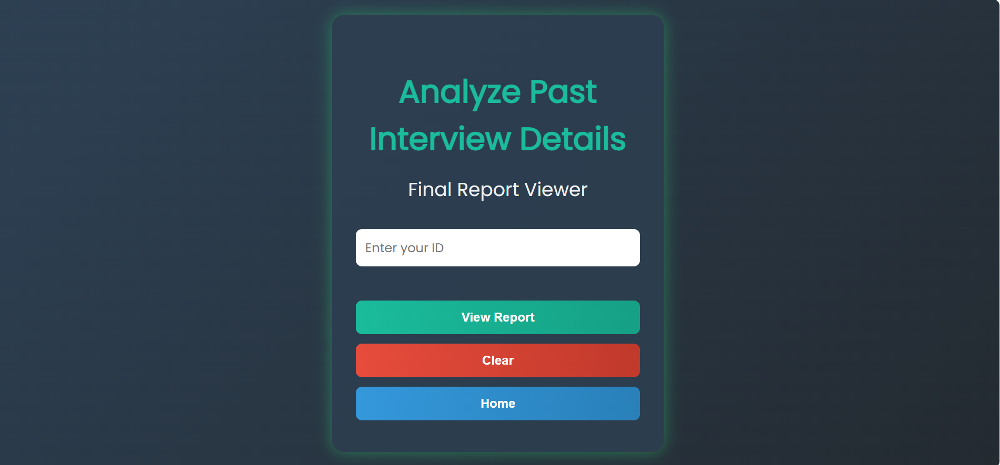
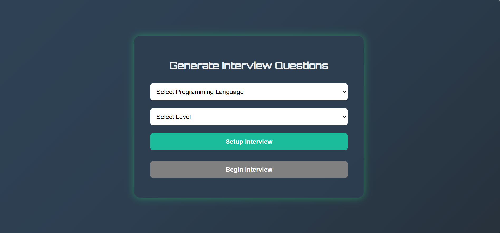

# 🤖 AI-Interviewer

Welcome to **AI-Interviewer** — an AI-powered mock interview platform designed to help candidates practice programming interviews with dynamic question generation and detailed performance reports.

---

## 🚀 Project Workflow

### 🏠 Home Page  
A clean landing page featuring two main buttons:  
- **Past Interview Details**  
- **Begin Interview**  

---

### 📊 Past Interview Details Page  
- User enters their **User ID**.  
- Fetches and displays the candidate’s interview report stored in the **Final_Report Collection** in the SQLite database.  
- Includes buttons:  
  - **Clear** (clears the displayed report)  
  - **Return Home** (navigates back to the main homepage)  

---

### 🎯 Begin Interview Flow

1. **Registration UI**  
   - User inputs: **ID**, **Name**, **Email**.  
   - Data saved to `User_collection` in SQLite3 database.  
   - Duplicate IDs are handled gracefully.  
   - User clicks **Next** to proceed.

2. **Setup Interview Page**  
   - User selects:  
     - Programming Language  
     - Difficulty Level (Easy, Medium, Hard)  
   - On clicking **Setup Interview**, the system calls the `Question_Generation_Module` to generate **10 questions** using **Google Gemini-2.0-flash** AI.  
   - Questions are saved in the `Question_Bank_Collection`.

3. **Interview Area**  
   - User clicks **Begin Interview** to start.  
   - Each question is displayed on the UI and spoken aloud using **gTTS** (Google Text-to-Speech).  
   - Candidate has **6 minutes** per question to write and submit code in the embedded editor.  
   - Upon submission, the answer along with the user ID is saved in the `Q_A_collection`.  
   - After completing all 10 questions, the interview ends.

4. **Final Report Generation**  
   - User navigates to the **Final Report Generator** page.  
   - Clicking **Generate Report** invokes the `FinalReportGenerator` module (also using Gemini-2.0-flash) to create a detailed report based on the candidate's answers and saved data.  
   - The report can be downloaded as a **PDF**.

---

## 🛠️ Technologies Used

- **Python**  
- **Flask** (Web Framework)  
- **gTTS** (Google Text-to-Speech)  
- **LangChain**  
- **Google Generative AI (Gemini-2.0-flash)**  
- **SQLite3** (Database)  
- **HTML / CSS / JavaScript / Bootstrap** (Frontend UI)

---

## 🎨 UI Snapshots

| Home Page | Interview Area | Past Interview Details | Question Generator |
| --------- | -------------- | --------------------- | ------------------ |
|  |  |  |  |

---

## ⚙️ How to Run the Project

```bash
# Clone the repo
git clone https://github.com/arhamkhan779/AI-Interviewer.git
cd AI-Interviewer

# Create a virtual environment
python -m venv venv

# Activate the virtual environment
# Windows
venv\Scripts\activate
# macOS/Linux
source venv/bin/activate

# Install dependencies
pip install -r requirements.txt

# Run the server
python server.py
